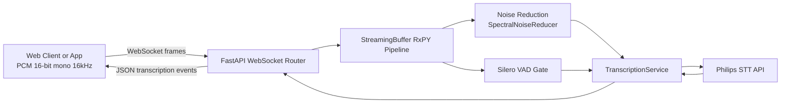
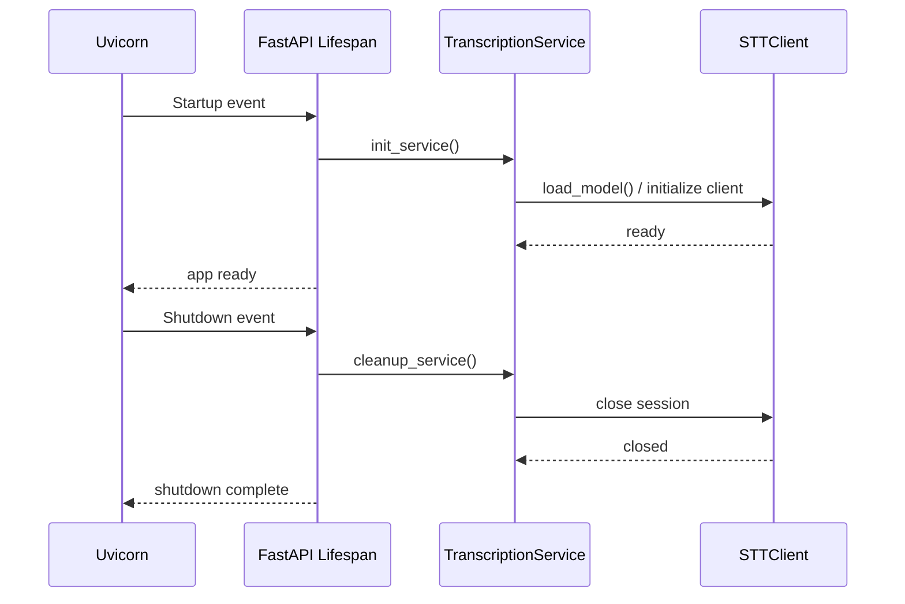
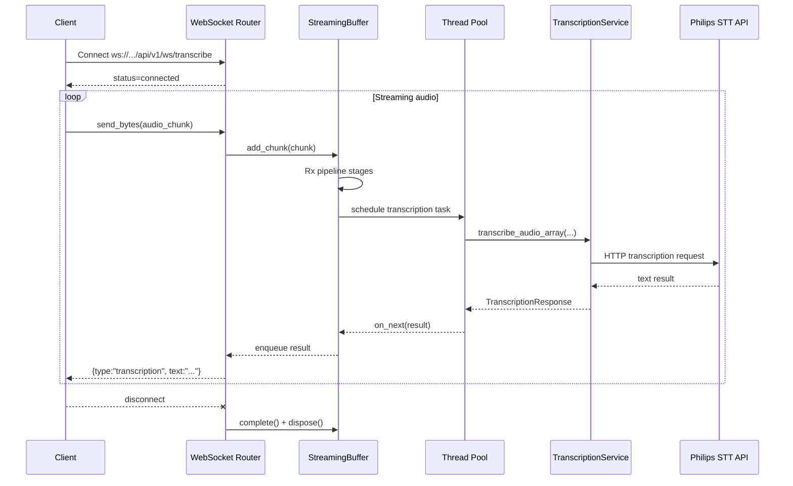
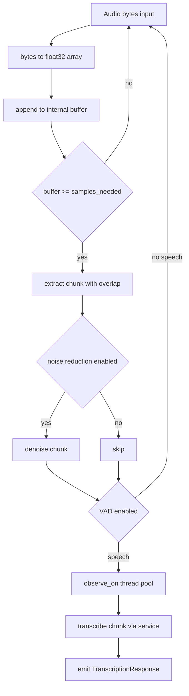
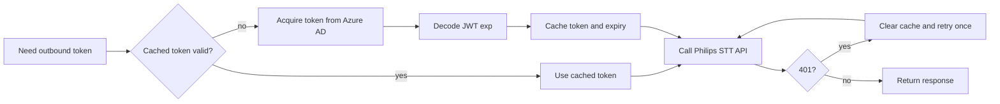

# STT POC Technical Architecture

## 1. Purpose and Scope

This document explains the runtime architecture, processing pipeline, concurrency model, and operational considerations of the STT POC service.

The system provides:
- Real-time speech-to-text over WebSocket.
- Audio pre-processing using optional Voice Activity Detection (VAD) and spectral noise reduction.
- Remote transcription using Philips AI Model Serving STT API.
- Health and service lifecycle management with FastAPI.

## 2. High-Level Architecture

### Main Responsibilities
- `app/main.py`: app bootstrapping, lifespan startup/shutdown hooks.
- `app/routers/transcribe_router.py`: WebSocket endpoint and health endpoint.
- `app/services/transcribe.py`: singleton service, stream buffer, reactive pipeline, async bridge.
- `app/clients/stt_client.py`: token acquisition/caching, resilient HTTP client, API calls.
- `app/services/silerovad.py`: speech detection.
- `app/services/noisereduce.py`: noise suppression.
- `app/schemas/transcribe_schema.py`: request/response contract.

## 3. Runtime Lifecycle

## 4. Real-Time WebSocket Processing

### Endpoint behavior
1. Accept WebSocket connection.
2. Send connected status payload.
3. Instantiate `StreamingBuffer` with feature toggles and thresholds.
4. Receive binary audio chunks continuously.
5. Emit transcription events asynchronously while receiving continues.
6. On disconnect, flush buffered audio and dispose subscriptions.

## 5. Reactive Pipeline Design (RxPY)

`StreamingBuffer` converts the inbound byte stream into a transformation pipeline.

### Why this model was chosen
- Keeps WebSocket receive loop responsive.
- Encapsulates streaming transformations as composable operators.
- Supports non-blocking fan-out of transcription events.

### 5.1 How RxPY Helps in Future Roadmap

RxPY gives this architecture a scalable stream-processing foundation as requirements grow.

- Stage extensibility:
    New steps like profanity filtering, keyword spotting, PII masking, sentiment scoring, and confidence gating can be added as additional operators without rewriting the full control flow.
- Multi-output fan-out:
    A single input stream can feed multiple consumers, such as live transcript UI, analytics pipeline, audit logs, and quality monitoring.
- Policy-driven behavior:
    Different customer profiles can use different operator chains, for example strict VAD for noisy call centers versus relaxed VAD for clinical dictation.
- Resilience controls:
    Stream-level timeout, retry, fallback, and error channels can be composed per stage, improving graceful degradation under upstream API instability.
- Observability alignment:
    Operators provide natural instrumentation boundaries for per-stage latency, drop rate, and throughput metrics.
- Incremental feature rollout:
    New processing stages can be introduced behind flags and evaluated with canary traffic before broad rollout.

Trade-off note:
RxPY should be retained when stream composition and branching complexity increases. If the pipeline remains strictly linear and simple, an asyncio queue model may be operationally simpler.

## 6. Concurrency and Threading Model

The design uses two cooperating concurrency domains:

1. AsyncIO event loop:
- Handles WebSocket I/O and result emission.
- Should remain non-blocking for low latency.

2. Thread pool workers:
- Perform CPU and network-heavy transcription steps.
- Triggered with Rx `observe_on(ThreadPoolScheduler)`.

Bridge pattern:
- Worker threads push completed results back into an `asyncio.Queue` using `loop.call_soon_threadsafe`.
- A dedicated async sender task consumes queue items and sends JSON to the WebSocket.

This prevents STT network latency from blocking inbound audio ingestion.

## 7. Outbound STT API Authentication and Resilience

This section describes authentication used by this service when calling Philips STT API (service-to-service), not client authentication on this service endpoints.

Current outbound strategy includes:
- Azure AD OAuth2 client-credentials flow for access token retrieval.
- Token caching with expiry tracking from JWT payload.
- Thread-safe token refresh via lock.
- Retry strategy for transient HTTP failures (429/5xx).
- Connection pooling via a shared requests.Session.
- One-time retry on 401 by clearing token cache.

## 8. Audio Processing Details

### 8.1 Noise Reduction
- Implements a spectral-domain noise suppression approach.
- Uses STFT, noise power estimation, gain masking, and ISTFT reconstruction.
- Includes guardrails to avoid over-suppression by reverting to raw audio if energy drop is excessive.

### 8.2 Voice Activity Detection (VAD)
- Uses Silero VAD model loaded once and shared across instances.
- Applies timestamp-based speech detection with configurable threshold and minimum speech duration.
- Filters non-speech chunks to reduce unnecessary STT API calls.

### 8.3 Language Detection and Filtering (LangDetect)
- Uses langdetect for post-transcription language detection.
- Keeps English-only output by dropping non-English transcript text before emission.
- Provides an additional guardrail when upstream language hinting is inconsistent.
- Language detection failures are treated conservatively and the segment is filtered out.

## 9. Data Contracts

WebSocket messages are strongly typed using Pydantic models:
- Status events (`type=status`).
- Transcription events (`type=transcription`, `text`, `is_final`).
- Error events (`type=error`).

Health endpoint returns service status and model/client load state.

## 10. Configuration and Dependencies

Primary dependencies include:
- FastAPI and Uvicorn for service runtime.
- reactivex for streaming pipeline composition.
- requests and PyJWT for API transport and token handling.
- torch and silero-vad for speech gating.
- scipy and numpy for DSP and denoising primitives.
- langdetect for post-transcription language filtering.

Environment variables:
- `AZURE_CLIENT_ID`
- `AZURE_CLIENT_SECRET`
- `AZURE_TENANT_ID` 
- `STT_API_HOST_URL` 
- `STT_API_SCOPE` 

## 11. Operational Considerations

### Latency drivers
- Chunk size configuration.
- VAD gate pass rate.
- Network RTT to STT API.
- API inference time.

### Reliability drivers
- Token refresh correctness.
- Retry policy tuning.
- Backpressure handling when producer rate exceeds consumer throughput.

### Security considerations
- Never commit credentials.
- Use least-privilege service principal scopes.
- Rotate secrets and monitor token acquisition errors.

## 12. Known Tuning Hotspots

- `chunk_duration_ms`: directly impacts latency and context size.
- `vad_threshold` and `min_speech_duration_ms`: controls false accept/reject behavior.
- `noise_reduce_strength` and gain floor: controls denoise aggressiveness.
- thread pool size: controls parallelism and CPU usage.

