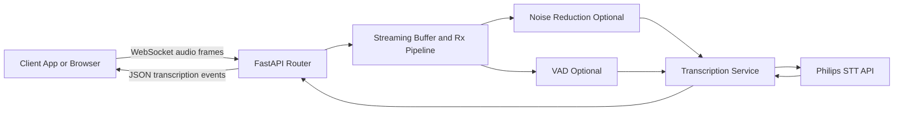
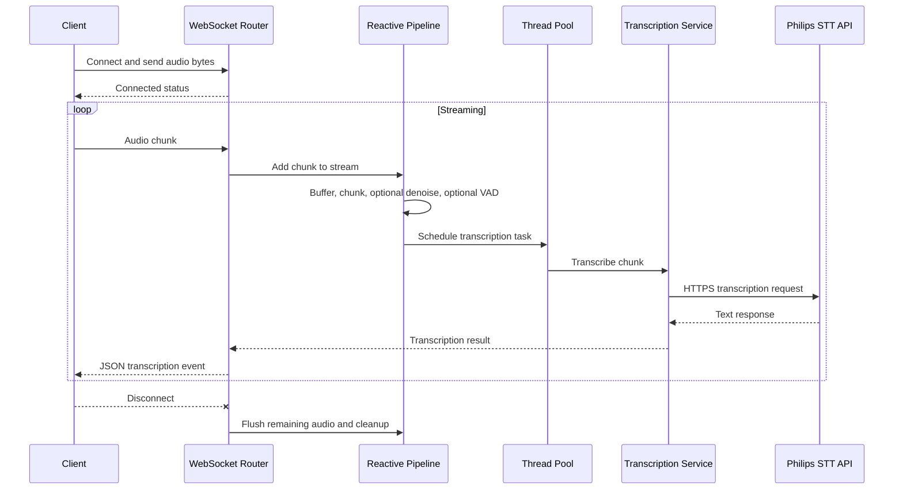

# Voice to Text Implementation Brief

Prepared for: EAADI and DAB discussions
Project: STT POC
Date: 2026-03-23

## 1. Executive Summary

This solution implements near real-time voice-to-text transcription for streaming audio. A client sends continuous PCM audio over WebSocket, the backend applies optional speech filtering and noise reduction, and then calls Philips AI Model Serving Speech-to-Text API to return text incrementally.

The approach is designed to balance:
- responsiveness for live conversations,
- robustness in noisy conditions,
- secure and reliable API integration,
- operational simplicity for deployment and scaling.

## 2. Business Goal and Scope

### Goal
Enable a production-oriented speech transcription service that can be integrated into real-time workflows and downstream applications.

### In Scope
- Real-time WebSocket transcription endpoint.
- Audio pre-processing (Voice Activity Detection and noise reduction).
- Secure API authentication with token caching.
- Health monitoring endpoint.

### Out of Scope for this POC
- Multi-language support beyond English.
- Speaker diarization.
- Domain adaptation and custom acoustic/language model tuning.

## 3. High-Level Approach

The architecture uses a streaming gateway pattern:
1. Client streams audio frames to backend via WebSocket.
2. Backend runs a non-blocking audio pipeline.
3. Backend sends speech chunks to Philips STT API.
4. Backend emits transcription events back to client immediately.

This allows continuous transcription while preserving low perceived latency.

## 4. Architecture Overview

### Core Components
- FastAPI application lifecycle and routing.
- StreamingBuffer with reactive pipeline for chunking and processing.
- STT client for authentication, retries, and transcription calls.
- Silero VAD service to gate non-speech audio.
- Spectral noise reduction service to improve audio quality.

## 5. End-to-End Runtime Flow

## 6. Technical Implementation Details

### 6.1 API and Transport Layer
- FastAPI hosts REST and WebSocket endpoints.
- WebSocket endpoint receives raw PCM audio and streams text responses.
- Health endpoint reports service readiness.

### 6.2 Streaming and Concurrency Model
- Audio processing uses a reactive stream pipeline.
- Transcription calls run on a thread pool to avoid blocking the async WebSocket event loop.
- Results are bridged safely from worker threads back to async sender tasks.

Why this matters:
- inbound audio remains responsive,
- outbound transcripts are not delayed by long API calls,
- service can handle concurrent workload more predictably.

### 6.3 Authentication and API Resilience
- OAuth client-credentials flow for access token acquisition.
- Token cache with expiry awareness to reduce auth overhead.
- Thread-safe token refresh.
- HTTP retry policy for transient failures.
- Cache reset and single retry on unauthorized response.

### 6.4 Audio Conditioning
- Optional VAD:
  - drops silent or non-speech frames,
  - reduces unnecessary API calls,
  - improves cost and throughput.
- Optional noise reduction:
  - applies spectral-domain suppression,
  - uses guardrails to avoid over-suppressing speech.

### 6.5 Language Strategy
- Current implementation is English-focused and enforces English path behavior.
- Additional language support can be added as a controlled enhancement.

## 7. Design Decisions and Rationale

1. WebSocket over request-response HTTP:
- chosen for low-latency streaming and continuous updates.

2. Reactive pipeline over monolithic loop:
- chosen for composable stages and cleaner non-blocking behavior.

3. Thread pool for transcription:
- chosen to isolate network and processing latency from event loop I/O.

4. VAD and denoise as optional toggles:
- chosen to tune quality versus latency per use case.

5. Token caching and retry policy:
- chosen for reliability and operational stability.

## 8. Security and Compliance Considerations

- Credentials are provided by environment variables, not hardcoded.
- HTTPS is used for remote STT API calls.
- Correlation ID support enables request traceability.
- Recommended production controls:
  - secret rotation policy,
  - centralized logging with redaction,
  - restricted service principal scope,
  - transport security and ingress controls.

## 9. Operational Considerations for EAADI and DAB

### Performance Levers
- chunk duration,
- VAD threshold and minimum speech duration,
- noise reduction strength,
- thread pool size,
- API timeout and retry settings.

### Monitoring Signals
- end-to-end transcription latency,
- queue depth and processing lag,
- API success and retry rates,
- token refresh failures,
- speech reject ratio from VAD.

### Reliability Risks and Mitigations
1. Network/API latency spikes:
- Mitigate with retry tuning, timeout tuning, and buffering policy.

2. Over-aggressive filtering:
- Mitigate with threshold calibration on real domain audio.

3. Burst traffic and backpressure:
- Mitigate with queue metrics, limits, and scaling policy.

4. Token/auth outages:
- Mitigate with alerting and fallback operational runbook.

## 10. Current Limitations

- English-only transcription behavior.
- No diarization or speaker separation.
- No explicit autoscaling orchestration in this POC layer.
- No formal SLO dashboards bundled in current codebase.

## 11. Recommended Next Steps

1. Define target SLOs for latency and availability.
2. Add metrics and tracing for each processing stage.
3. Build load-test profile for expected concurrency and burst scenarios.
4. Add integration test suite for streaming edge cases.
5. Create phase-2 roadmap for multilingual and diarization capabilities.

## 12. DAB Talking Points

- Why this architecture is suitable for near real-time speech workflows.
- How concurrency model protects responsiveness under variable API latency.
- Trade-off model between audio quality enhancement and latency.
- Operational readiness plan for monitoring, resilience, and security hardening.
- Clear path from POC to production-grade deployment.

## 13. References

- Silero VAD: https://github.com/snakers4/silero-vad
- Noise reduction reference paper: https://ieeexplore.ieee.org/stamp/stamp.jsp?arnumber=1164453
- Additional repository docs:
  - docs/TECHNICAL_ARCHITECTURE.md
  - docs/research/README.md
